# Smarter Pay - Digital Banking & Payments System 🚀

**Smarter Pay** is an advanced digital banking and secure mobile payment platform designed to provide seamless financial transactions, intelligent account management, and state-of-the-art features like NFC-based contactless payments and verified digital receipts.

---

## 📱 App Screenshots

Here is a comprehensive overview of the Smarter Pay application interface and features across its various screens:

| Login Screen | Dashboard (Arabic) | Verified Transfer Receipt | NFC Request |
| :---: | :---: | :---: | :---: |
| 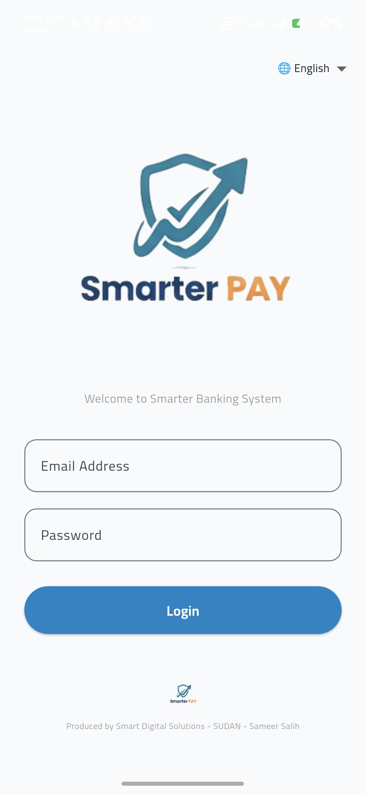 | 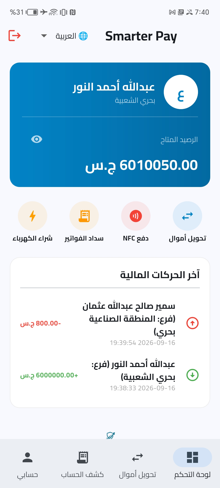 | 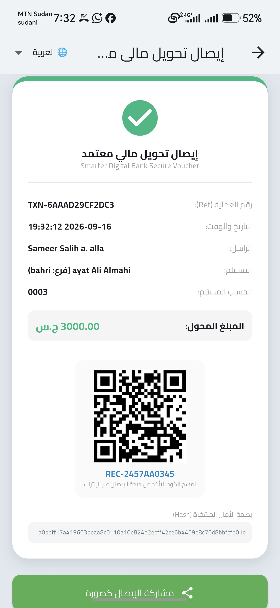 | 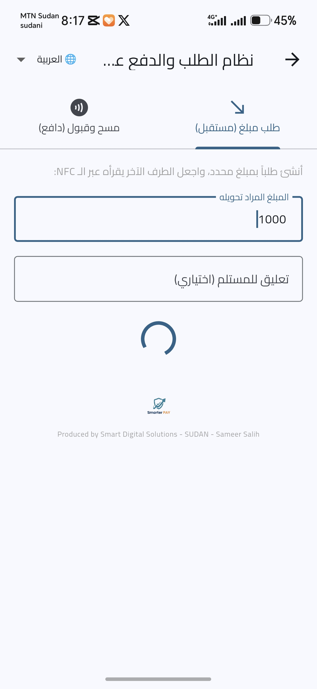 |

| Money Transfer Form | NFC Scan & Pay | Transfer Confirmation | Account Statement (Arabic) |
| :---: | :---: | :---: | :---: |
| 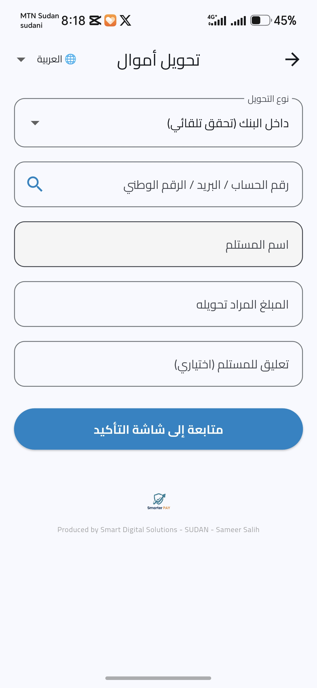 | 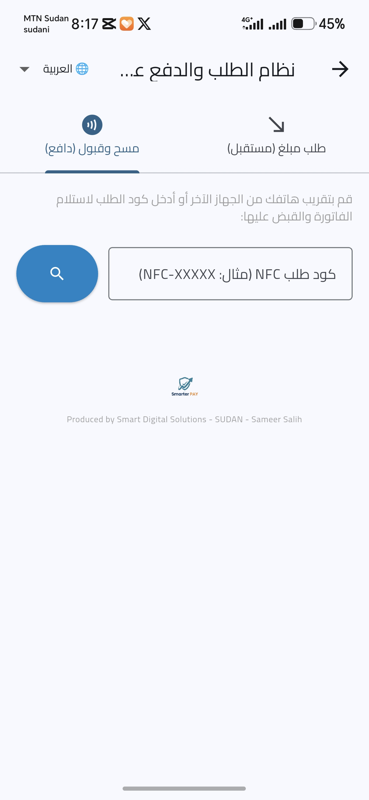 | 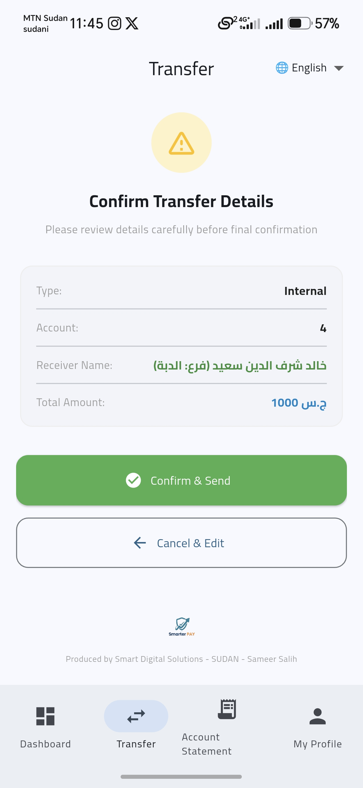 | 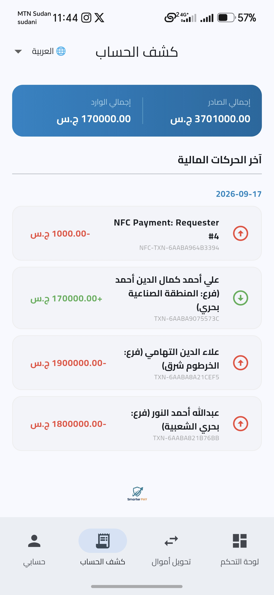 |

| Dashboard (English) | Account Statement (English) | Transfer (English) | Receipt Verification |
| :---: | :---: | :---: | :---: |
| 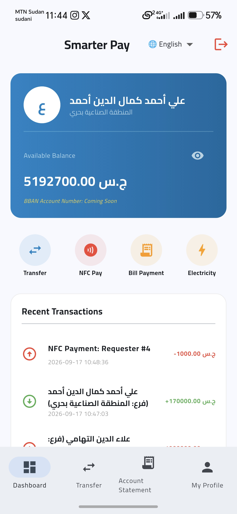 | 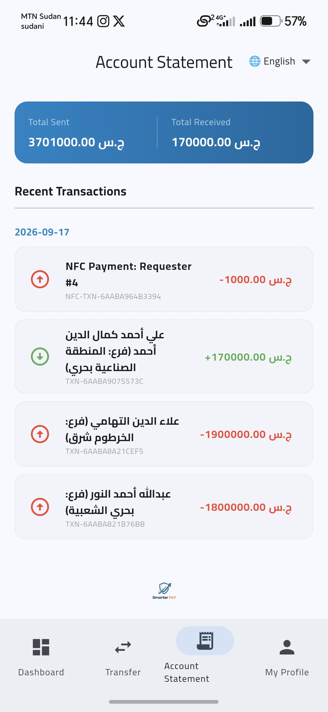 | 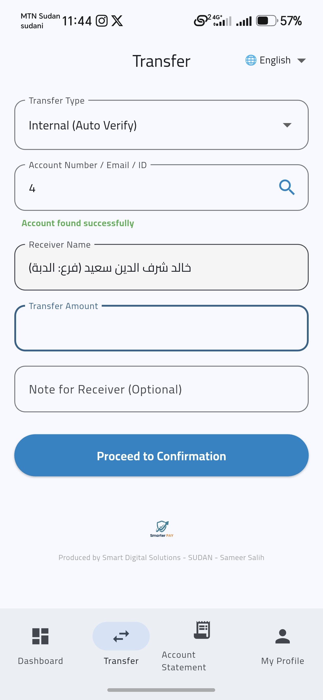 | 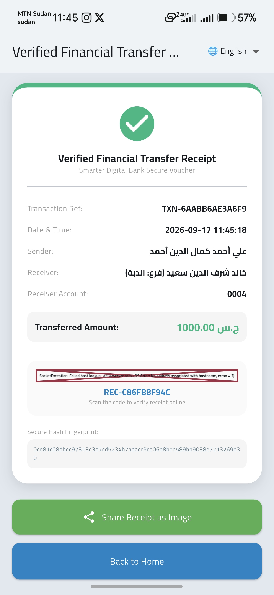 |

| Verified Voucher 1 | Verified Voucher 2 | User Profile (Secure Read-Only) |
| :---: | :---: | :---: |
| 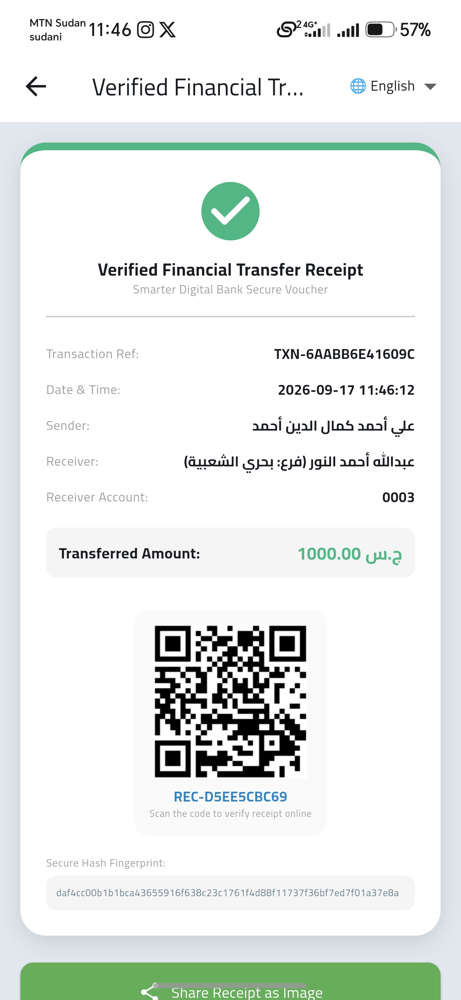 | 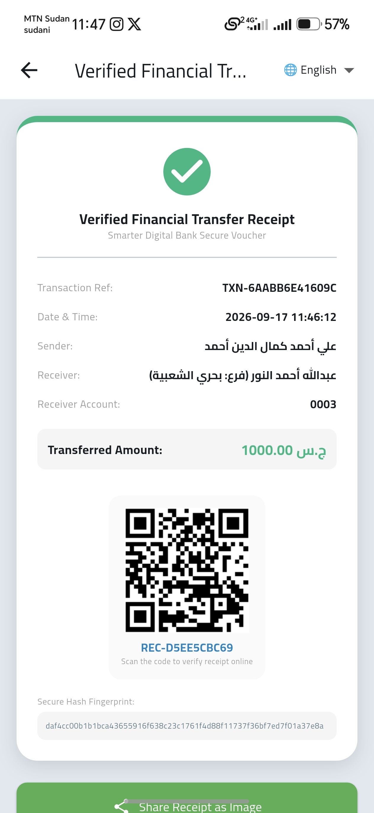 | 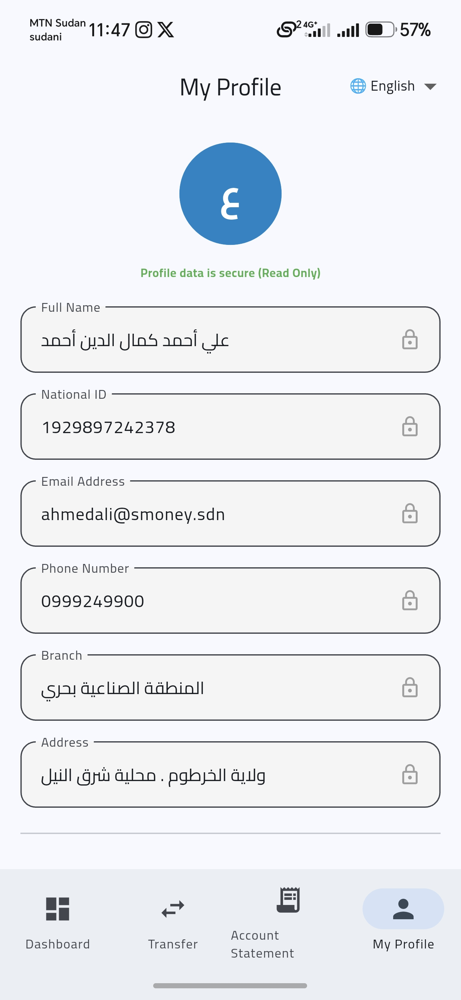 |

---

## ✨ Key Features

- **🔐 Secure Authentication:** Robust login system with full multi-language support (Arabic & English).
- **💳 Interactive NFC Request & Payment:** 
  - Broadcast payment requests using NFC waves.
  - Smart auto-capture and physical/interactive tag scanning for instant settlements.
- **💸 Instant Money Transfers:** Internal and external bank transfers with live account verification, dynamic receiver details matching, and confirmation steps.
- **🧾 Certified Secure Vouchers:** Generate official transaction receipts complete with unique cryptographic Secure Hashes and QR codes for online verification.
- **📊 Detailed Account Statements:** Grouped transaction history by date, tracking total sent and received amounts dynamically with visual indicators.
- **👤 Protected User Profile:** Secure, read-only personal and banking credential management displaying National ID, registered phone, email, and branch info.
- **🌐 Bilingual Support:** Full RTL and LTR support for Arabic and English users seamlessly.

---

## 🛠️ Tech Stack

- **Frontend & Mobile App:** Flutter (Dart), Material Design 3, Provider/State Management.
- **Backend & API:** PHP, MySQL, RESTful APIs.
- **Key Packages & Plugins:** 
  - `nfc_manager` for contactless hardware integration.
  - `screenshot` & `share_plus` for generating and sharing digital receipts.
  - `audioplayers` for transaction audio feedback.

---

## 📂 Project Structure

Ensure your screenshots are placed inside the `screens/` directory in the root folder matching the image names (`1.jpg` through `18.jpg`) as referenced in the markdown tables above.

---

## 👨‍💻 Author & Credits

- **Produced by:** Smart Digital Solutions - SUDAN
- **Lead Developer:** Sameer Salih

---
*(C) 2026 Smart Digital Solutions. All rights reserved.*
